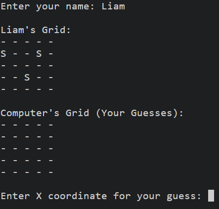
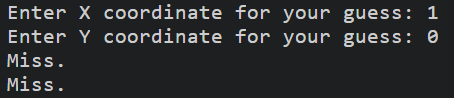
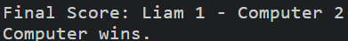
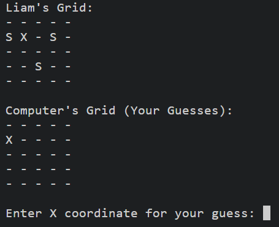

# Battleship Game

Welcome to the easy but fun Battleship Game, a command-line version of the classic strategy game implemented in Python. This game pits you against a computer opponent in a naval warfare simulation on a 5x5 grid. With enhanced features and gameplay mechanics, it offers an engaging experience for players looking to test their strategic thinking.

## Features

- **5x5 Grid Battlespace**: A compact yet challenging field for tactical maneuvers.
- **Random Ship Placement**: Each game has a unique setup with randomly placed ships.
- **Shot Limit**: The game is intensified with a 20-shot limit, ensuring quick and decisive gameplay (10 shots each for Player and Computer).
- **Advanced Scoring System**: Keep track of your hits and misses to outsmart the computer.
- **Simple Interface**: Easy-to-use command-line interface for all levels of players.

# How to Play
1. Run the script in a Python environment.
2. Enter your name when prompted.
3. You will see your board with your ships (marked as 'S') and the hits or misses.
4. Enter the row and column numbers to hit a spot on the computer's board.
5. The game will indicate whether it was a hit or a miss.
6. The game ends when all ships on one board are sunk or when all shots are used up.

## Example pictures:
### Game Start:

- 
### cordinates:

- 
### Win Or Loose:

# Limitations
- The game currently does not have a graphical interface; it only runs in the console.
- There is no difficulty level for the computer, it makes random guesses.
- Board size and number of ships are fixed and cannot be changed.

# Code Structure
- BattleshipGame: The main class that handles game logic.
- __init__: Initializes the game settings.
- place_ships_randomly: Randomly places ships on the grid.
- print_grid: Displays the current state of the grid.
- make_guess: Handles the logic for guessing ship positions.
- get_valid_coordinate: Validates player input.
- computer_turn: Manages the computer's turn.
- player_turn: Manages the player's turn.
- start_game: Starts the game loop.

# Installation
- No additional libraries is required to run this game. Just ,ake sure you have Python installed on your system.

# Future Enhancements
- Adding a graphical user interface.
- Implementing adjustable difficulty levels.
- Allowing customizable board sizes and number of ships.

1. Graphics:
- 

# FAQ
- Q: Can I change the grid size?
A: Currently, the grid size is fixed at 5x5, but you can modify the grid_size variable in the code for a different size.
- Q: Is it possible to play with another human player?
A: The current version is designed for a single player against a computer. Implementing a two-player mode could be a great contribution!

# Issues

- The Pythone code sows some issues, it dose not effect this game.
- While developing this game, i aimed to adhere to standard Python coding practices.
- some style guide warnings if you run a linter on the code. These include:

3: E302 expected 2 blank lines, found 1
6: E501 line too long (96 > 79 characters)
7: E501 line too long (98 > 79 characters)
8: E501 line too long (106 > 79 characters)
16: E501 line too long (99 > 79 characters)
54: E501 line too long (80 > 79 characters)
61: E501 line too long (95 > 79 characters)
69: E501 line too long (80 > 79 characters)
70: E501 line too long (80 > 79 characters)
71: E501 line too long (90 > 79 characters)
102: E501 line too long (94 > 79 characters)
111: E305 expected 2 blank lines after class or function definition, found 1

I plan to address these in future updates so it stands up to PEP 8 standards.